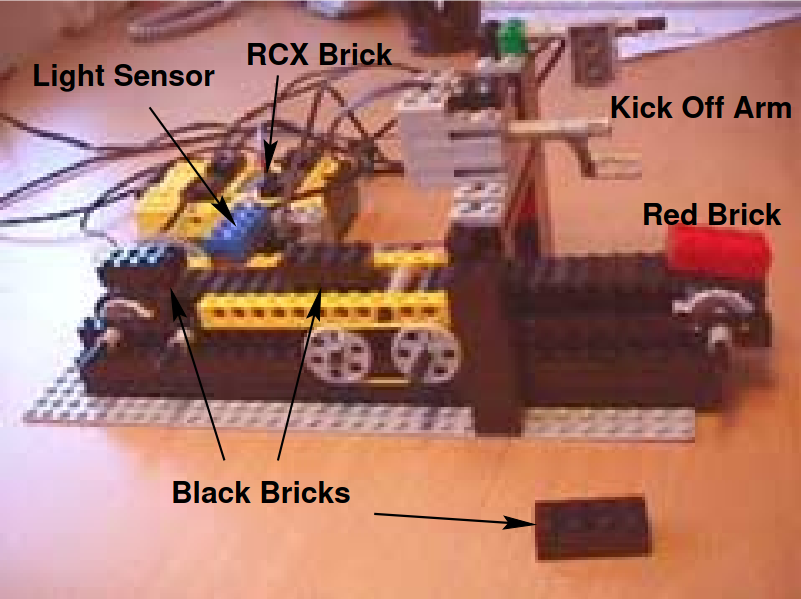

# Bricksorter-rs
In 2000 ["Model-checking real-time control programs: verifying LEGO MINDSTORMS systems using UPPAAL"](https://ieeexplore.ieee.org/document/854002) was published on automatic, formal verification real-time control programs for LEGO MINDSTORMS systems on the RCX processor. 

This project is a Rust implementation on the EV3 brick enhanced with ev3dev (Debian Linux for the EV3 platform), 
using ev3dev-lang-rust bindings to write embedded firmware for the EV3 brick in Rust using ev3dev-lang-rust's Hardware Abstraction Layer (HAL) for EV3 and assorted sensors and motors.

## Enhancements over original demo
- Uses 2x colour sensors, 1x light intensity sensor, 1x belt motor, 1x kicker motor
- Uses debouncing for the colour sensors to prevent false detections
- Uses enhanced motor control for angular and power modulation
- Sorts into 3 bins based on colour, using bi-directional kicker

## Demo usage
1. Turn on the EV3 brick (hold down middle button)
2. Wait until Debian has booted. You will be presented with a menu.
3. Navigate to shell wrapper:
   1. 'File Browser' -> 'bricksorter-*' (choose between below variants)
      - `bricksorter-vanilla` (sorts, with no drilling operation)
      - `bricksorter-drill` (sorts, with drilling operation)
      - `bricksorter-debug-drill` (sorts, drills, and puts debug output to console on EV3)
   2. Execute selected binary by pressing middle button
4. Program will start and you can place bricks on the belt and watch them being sorted (optionally also _drilled_).
5. When finished, press back button to exit
6. To shut down brick, press back button on home-menu to bring up power menu and select 'Power Off'

## Flash new firmware
1. Turn on the EV3 brick (hold down middle button)
2. Wait until Debian has booted and you have ethernet-over-USB interface up
3. Run `deploy.sh` to build and deploy the project to the EV3 brick
4. It will run immediately, pressing `Ctrl+C` will stop the program and exit the SSH-session
5. Subsequent runs can be invoked without connection to the Linux machine by using the `run.sh` wrapper as described in demo usage.

## Replication on raw EV3 brick
Use the following if recreating the demo from scratch:

1. Install ev3dev on your EV3 brick
2. Configure ethernet-over-USB to your Linux machine
3. Setup SSH to your EV3 brick (`robot:maker`)
4. Clone this repository to your Linux machine
5. Using `rustup` install the nightly toolchain for ARMv5
6. Build and deploy the project using `deploy.sh`
